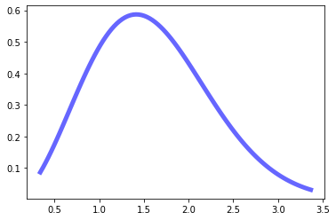
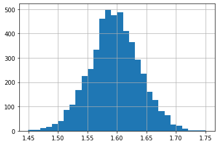

## The Standard Error of the Mean

The Standard Error of the Mean ($SE$) is the **standard deviation** of the **sample distribution** of the **sample mean**. To understand what this means, let's break that sentence down in reverse order (i.e. chronologically):


**Sample Mean**: we have some probability density function $P$ for a population. We take a sample of $N$ instances from it and calculate our statistic of interest - in this case the mean, $\bar{x}$. We have to take samples because it is hard/impossible to look at every instance in an entire population to calculate the true mean $\mu$ hidden to us in nature (i.e. say we were interested in the average weight of all monkeys on the planet).


**Sample Distribution**: we take many samples (the number of which denoted by $M$) from the population's probability density function $P$ and calculate the sample mean $\bar{x}$ for each one. All of these sample means can be lumped together into a distribution $S$, which approximates a normal distribution the higher $M$ is due to the **Central Limit Theorum**. We want to create a sampling distribution because it allows us to reason about the likelihood of different values the sample mean can be. By doing so, we can look at the mean of this distribution and conclude that its the most likely value for $\mu$ given the data we've used.

**Standard Deviation**: The standard deviation is a metric that describes the dispersion of a dataset/distribution in relation to its mean. It speaks to how close/far the density of the distribution is spread in relation to its mean. The standard deviation of a sample distribution - our standard error $SE$ - is an indication of how representative the distribution is of our true mean $\mu$. The smaller it is, the more representative it can be said to be; the larger it is, the harder it is to trust.


**TLDR: The Standard Error matters because it allows us to better understand how representative our sampling distribution is (i.e. our model of the true mean).**

<!--more-->


$SE$ can be calculated with this formula:

$$SE = \frac{\sigma}{\sqrt{N}}$$

where ${\sigma}$ is the standard deviation of the population's probability density function $P$ and $N$ is the number of instances in a sample.  


## Understanding the Standard Error through Simulation


```python
import numpy as np
import scipy as sp
import pandas as pd
import matplotlib.pyplot as plt
```


```python
# create a random probability distribution function to model our population
# in this case a Maxwell continuous random variable (picked randomly)

x = np.linspace(sp.stats.maxwell.ppf(0.01),
                sp.stats.maxwell.ppf(0.99), 100)
plt.plot(x, sp.stats.maxwell.pdf(x), 'b-', lw=5, alpha=0.6, label='maxwell pdf')
plt.show()

mean, var, skew, kurt = sp.stats.maxwell.stats(moments='mvsk')

print(f'The true mean of the population is {mean} and its standard deviation is {var**(1/2)}')
```





    The true mean of the population is 1.5957691216057308 and its standard deviation is 0.6734396116428514


```python
# to create our sampling distribution S we take M samples of N instances each
# we calculate the mean of each sample and add it to a list, which we can make a histogram with

m_samples = 5000
n_instances = 250

sample_means = []

for m in range(m_samples):
    sample = sp.stats.maxwell.rvs(size=n_instances) # draw a sample from the population
    sample_means.append(sample.mean()) # add it to our sampling distribution
    
sample_dist = pd.Series(sample_means) # our sample distribution as a pandas series
```


```python
sample_dist.hist(bins=30) # visualizing our sample distribution of the sample mean
```


    <matplotlib.axes._subplots.AxesSubplot at 0x1341e8fd0>





```python
print(f"The mean of our sample distribution is {sample_dist.mean()}")
print(f"Its standard deviation (The Standard Error) is {sample_dist.std()}")
```

    The mean of our sample distribution is 1.5960355829136528
    Its standard deviation (The Standard Error) is 0.04222284486122923


```python
# calculating the same SE from the formula above

se = np.sqrt(var)/np.sqrt(n_instances)
print(f"The standard error calculated with the formula is: {se}")
```

    The standard error calculated with the formula is: 0.042592060787413163

