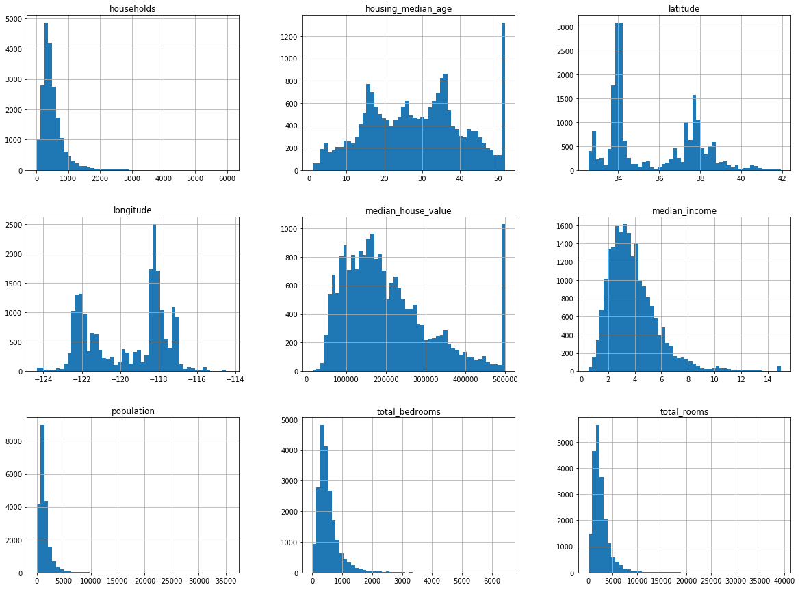
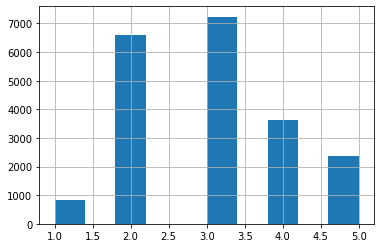

<!--more--> 

## Notes

Main Steps:
1. Frame the problem
2. Get data
3. EDA (exploratory data analysis)
4. Prepare the data for ML
5. Model Selection
6. Tune the model
7. Present solution
8. Launch, monitor, iterate

### Look at the big picture
- predict the median housing price for a district in CA
- what's the business objective (not building a model for fun)
- ask: what is the current, non-ML solution? why can't we use that
- start thinking about/designing the system

Pipelines
- sequence of data processing components
- typically runs asynchronously:
- When you execute something synchronously, you wait for it to finish before moving on to another task. When you execute something asynchronously, you can move on to another task before it finishes.
- components are self contained, downstream components can keep working for a while by just using the last output from the broken component (async)

Types of Regression
- multiple regression: multiple features to make a prediction
- univariate regression: only trying to predict a single value

Selecting a performance measure
- Root Mean Square Error (RMSE):

$$ RMSE(X,h) = \sqrt{\frac{1}{m} \sum_{i=1}^{m} (h(x^{(i)}) - y^{(i)})^{2}} $$

- gives higher weight to larger errors
- lowercase italic font for scalars, lowercase bold for vectors, uppercase bold for matrices
- if there are many outliers, then Mean Absolute Error (MAE) might be a better cost function:

$$ MAE(X,h) = \frac{1}{m} \sum_{i=1}^{m} \lvert h(x^{(i)}) - y^{(i)}\rvert$$

- different ways to measure difference between vectors
- RMSE is euclidian distance, $l_2$ norm
- computing sum of absolutes is $l_1$ norm, measures the distance between two points if you can only travel along orthogonal (perpendicular) lines
- $l_0$ just gives the number of non-zero elements in vector
- higher the norm index, the more it focuses on large values and neglects smaller ones. this is why RMSE is more sensitive to outliers than MAE

Verify Assumptions
- list and verify assumptions
- e.g. what does the output exactly need to be, what do we think is true about the problem/solution we've proposed

### Get the Data
- usually data is in DBs or spread across many files, so common first step is jumping through the hoops of access, getting used to schemas, legal precautions, etc.
- best to automate process of fetching data, future proof against changes


```python
import os
import tarfile
from six.moves import urllib
```


```python
DOWNLOAD_ROOT = "https://raw.githubusercontent.com/ageron/handson-ml/master/"
HOUSING_PATH = os.path.join("datasets", "housing")
HOUSING_URL = DOWNLOAD_ROOT + "datasets/housing/housing.tgz"

def fetch_housing_data(housing_url=HOUSING_URL, housing_path=HOUSING_PATH):
    if not os.path.isdir(housing_path):
        os.makedirs(housing_path)
    tgz_path = os.path.join(housing_path, "housing.tgz")
    urllib.request.urlretrieve(housing_url, tgz_path)
    housing_tgz = tarfile.open(tgz_path)
    housing_tgz.extractall(path=housing_path)
    housing_tgz.close()
```


```python
fetch_housing_data()
```


```python
import pandas as pd
```


```python
def load_housing_data(housing_path=HOUSING_PATH):
    csv_path = os.path.join(HOUSING_PATH, "housing.csv")
    return pd.read_csv(csv_path)
```


```python
housing = load_housing_data()
housing.head()
```


<div>
<style scoped>
    .dataframe tbody tr th:only-of-type {
        vertical-align: middle;
    }

    .dataframe tbody tr th {
        vertical-align: top;
    }

    .dataframe thead th {
        text-align: right;
    }
</style>
<table border="1" class="dataframe">
  <thead>
    <tr style="text-align: right;">
      <th></th>
      <th>longitude</th>
      <th>latitude</th>
      <th>housing_median_age</th>
      <th>total_rooms</th>
      <th>total_bedrooms</th>
      <th>population</th>
      <th>households</th>
      <th>median_income</th>
      <th>median_house_value</th>
      <th>ocean_proximity</th>
    </tr>
  </thead>
  <tbody>
    <tr>
      <td>0</td>
      <td>-122.23</td>
      <td>37.88</td>
      <td>41.0</td>
      <td>880.0</td>
      <td>129.0</td>
      <td>322.0</td>
      <td>126.0</td>
      <td>8.3252</td>
      <td>452600.0</td>
      <td>NEAR BAY</td>
    </tr>
    <tr>
      <td>1</td>
      <td>-122.22</td>
      <td>37.86</td>
      <td>21.0</td>
      <td>7099.0</td>
      <td>1106.0</td>
      <td>2401.0</td>
      <td>1138.0</td>
      <td>8.3014</td>
      <td>358500.0</td>
      <td>NEAR BAY</td>
    </tr>
    <tr>
      <td>2</td>
      <td>-122.24</td>
      <td>37.85</td>
      <td>52.0</td>
      <td>1467.0</td>
      <td>190.0</td>
      <td>496.0</td>
      <td>177.0</td>
      <td>7.2574</td>
      <td>352100.0</td>
      <td>NEAR BAY</td>
    </tr>
    <tr>
      <td>3</td>
      <td>-122.25</td>
      <td>37.85</td>
      <td>52.0</td>
      <td>1274.0</td>
      <td>235.0</td>
      <td>558.0</td>
      <td>219.0</td>
      <td>5.6431</td>
      <td>341300.0</td>
      <td>NEAR BAY</td>
    </tr>
    <tr>
      <td>4</td>
      <td>-122.25</td>
      <td>37.85</td>
      <td>52.0</td>
      <td>1627.0</td>
      <td>280.0</td>
      <td>565.0</td>
      <td>259.0</td>
      <td>3.8462</td>
      <td>342200.0</td>
      <td>NEAR BAY</td>
    </tr>
  </tbody>
</table>
</div>


```python
housing.info()
```

    <class 'pandas.core.frame.DataFrame'>
    RangeIndex: 20640 entries, 0 to 20639
    Data columns (total 10 columns):
    longitude             20640 non-null float64
    latitude              20640 non-null float64
    housing_median_age    20640 non-null float64
    total_rooms           20640 non-null float64
    total_bedrooms        20433 non-null float64
    population            20640 non-null float64
    households            20640 non-null float64
    median_income         20640 non-null float64
    median_house_value    20640 non-null float64
    ocean_proximity       20640 non-null object
    dtypes: float64(9), object(1)
    memory usage: 1.6+ MB


```python
housing["ocean_proximity"].value_counts()
```


    <1H OCEAN     9136
    INLAND        6551
    NEAR OCEAN    2658
    NEAR BAY      2290
    ISLAND           5
    Name: ocean_proximity, dtype: int64


```python
housing.describe()
```


<div>
<style scoped>
    .dataframe tbody tr th:only-of-type {
        vertical-align: middle;
    }

    .dataframe tbody tr th {
        vertical-align: top;
    }

    .dataframe thead th {
        text-align: right;
    }
</style>
<table border="1" class="dataframe">
  <thead>
    <tr style="text-align: right;">
      <th></th>
      <th>longitude</th>
      <th>latitude</th>
      <th>housing_median_age</th>
      <th>total_rooms</th>
      <th>total_bedrooms</th>
      <th>population</th>
      <th>households</th>
      <th>median_income</th>
      <th>median_house_value</th>
    </tr>
  </thead>
  <tbody>
    <tr>
      <td>count</td>
      <td>20640.000000</td>
      <td>20640.000000</td>
      <td>20640.000000</td>
      <td>20640.000000</td>
      <td>20433.000000</td>
      <td>20640.000000</td>
      <td>20640.000000</td>
      <td>20640.000000</td>
      <td>20640.000000</td>
    </tr>
    <tr>
      <td>mean</td>
      <td>-119.569704</td>
      <td>35.631861</td>
      <td>28.639486</td>
      <td>2635.763081</td>
      <td>537.870553</td>
      <td>1425.476744</td>
      <td>499.539680</td>
      <td>3.870671</td>
      <td>206855.816909</td>
    </tr>
    <tr>
      <td>std</td>
      <td>2.003532</td>
      <td>2.135952</td>
      <td>12.585558</td>
      <td>2181.615252</td>
      <td>421.385070</td>
      <td>1132.462122</td>
      <td>382.329753</td>
      <td>1.899822</td>
      <td>115395.615874</td>
    </tr>
    <tr>
      <td>min</td>
      <td>-124.350000</td>
      <td>32.540000</td>
      <td>1.000000</td>
      <td>2.000000</td>
      <td>1.000000</td>
      <td>3.000000</td>
      <td>1.000000</td>
      <td>0.499900</td>
      <td>14999.000000</td>
    </tr>
    <tr>
      <td>25%</td>
      <td>-121.800000</td>
      <td>33.930000</td>
      <td>18.000000</td>
      <td>1447.750000</td>
      <td>296.000000</td>
      <td>787.000000</td>
      <td>280.000000</td>
      <td>2.563400</td>
      <td>119600.000000</td>
    </tr>
    <tr>
      <td>50%</td>
      <td>-118.490000</td>
      <td>34.260000</td>
      <td>29.000000</td>
      <td>2127.000000</td>
      <td>435.000000</td>
      <td>1166.000000</td>
      <td>409.000000</td>
      <td>3.534800</td>
      <td>179700.000000</td>
    </tr>
    <tr>
      <td>75%</td>
      <td>-118.010000</td>
      <td>37.710000</td>
      <td>37.000000</td>
      <td>3148.000000</td>
      <td>647.000000</td>
      <td>1725.000000</td>
      <td>605.000000</td>
      <td>4.743250</td>
      <td>264725.000000</td>
    </tr>
    <tr>
      <td>max</td>
      <td>-114.310000</td>
      <td>41.950000</td>
      <td>52.000000</td>
      <td>39320.000000</td>
      <td>6445.000000</td>
      <td>35682.000000</td>
      <td>6082.000000</td>
      <td>15.000100</td>
      <td>500001.000000</td>
    </tr>
  </tbody>
</table>
</div>


- percentiles: what percentage of the data falls beneath this point. i.e. if 50th percentile is 100 for an attribute that means half of all the samples have a value less than 100 for that attribute
- if mean varies a lot from median that speaks to the presence of outliers pulling it up/down


```python
%matplotlib inline
import matplotlib.pyplot as plt
```


```python
housing.hist(bins=50, figsize=(20,15))
plt.show()
```





- Median income doesn't seem to be expressed as USD
- Median house value and age seem to be capped
- features have different scales (needs feature scaling)

Create a test set
- before anything else, set aside test set
- this will avoid data snooping bias; i.e. fitting the model to better generalize on the test set


```python
import numpy as np
```


```python
def split_train_test(data, test_ratio):
    shuffled_indices = np.random.permutation(len(data))
    test_set_size = int(len(data) * test_ratio)
    test_indices = shuffled_indices[:test_set_size]
    train_indices = shuffled_indices[test_set_size:]
    return data.iloc[train_indices], data.iloc[test_indices]
```


```python
train_set, test_set = split_train_test(housing, 0.2)
```


```python
len(train_set)
```


    16512


```python
len(test_set)
```


    4128


- this function will regenerate different sets on each run
- you can seed the random number generator, but this breaks if you add new data to the dataset (regenerates new train/test)
- eventually data you've trained on before will make it into the test set on multiple reruns with this pipeline
- can use each instance's indentifier (assuming unique and immutable) to decide whether or not it should go in the test set
- code below computes a hash of each instance's indentifier and puts that instance in the test set if hash is lower or equal to 20% of the maximum hash value. ensures consistency across multiple runs, and the test set will always contain 20% of the new data, but never any instance that was previously in the training set


```python
from zlib import crc32

def test_set_check(identifier, test_ratio):
    return crc32(np.int64(identifier)) & 0xffffffff < test_ratio * 2**32

def split_train_test_by_id(data, test_ratio, id_column):
    ids = data[id_column]
    in_test_set = ids.apply(lambda id_: test_set_check(id_, test_ratio))
    return data.loc[~in_test_set], data.loc[in_test_set]
```


```python
housing_with_id = housing.reset_index()
train_set, test_set = split_train_test_by_id(housing_with_id, 0.2, "index")
```


```python
train_set
```


<div>
<style scoped>
    .dataframe tbody tr th:only-of-type {
        vertical-align: middle;
    }

    .dataframe tbody tr th {
        vertical-align: top;
    }

    .dataframe thead th {
        text-align: right;
    }
</style>
<table border="1" class="dataframe">
  <thead>
    <tr style="text-align: right;">
      <th></th>
      <th>index</th>
      <th>longitude</th>
      <th>latitude</th>
      <th>housing_median_age</th>
      <th>total_rooms</th>
      <th>total_bedrooms</th>
      <th>population</th>
      <th>households</th>
      <th>median_income</th>
      <th>median_house_value</th>
      <th>ocean_proximity</th>
    </tr>
  </thead>
  <tbody>
    <tr>
      <td>0</td>
      <td>0</td>
      <td>-122.23</td>
      <td>37.88</td>
      <td>41.0</td>
      <td>880.0</td>
      <td>129.0</td>
      <td>322.0</td>
      <td>126.0</td>
      <td>8.3252</td>
      <td>452600.0</td>
      <td>NEAR BAY</td>
    </tr>
    <tr>
      <td>1</td>
      <td>1</td>
      <td>-122.22</td>
      <td>37.86</td>
      <td>21.0</td>
      <td>7099.0</td>
      <td>1106.0</td>
      <td>2401.0</td>
      <td>1138.0</td>
      <td>8.3014</td>
      <td>358500.0</td>
      <td>NEAR BAY</td>
    </tr>
    <tr>
      <td>3</td>
      <td>3</td>
      <td>-122.25</td>
      <td>37.85</td>
      <td>52.0</td>
      <td>1274.0</td>
      <td>235.0</td>
      <td>558.0</td>
      <td>219.0</td>
      <td>5.6431</td>
      <td>341300.0</td>
      <td>NEAR BAY</td>
    </tr>
    <tr>
      <td>4</td>
      <td>4</td>
      <td>-122.25</td>
      <td>37.85</td>
      <td>52.0</td>
      <td>1627.0</td>
      <td>280.0</td>
      <td>565.0</td>
      <td>259.0</td>
      <td>3.8462</td>
      <td>342200.0</td>
      <td>NEAR BAY</td>
    </tr>
    <tr>
      <td>6</td>
      <td>6</td>
      <td>-122.25</td>
      <td>37.84</td>
      <td>52.0</td>
      <td>2535.0</td>
      <td>489.0</td>
      <td>1094.0</td>
      <td>514.0</td>
      <td>3.6591</td>
      <td>299200.0</td>
      <td>NEAR BAY</td>
    </tr>
    <tr>
      <td>...</td>
      <td>...</td>
      <td>...</td>
      <td>...</td>
      <td>...</td>
      <td>...</td>
      <td>...</td>
      <td>...</td>
      <td>...</td>
      <td>...</td>
      <td>...</td>
      <td>...</td>
    </tr>
    <tr>
      <td>20635</td>
      <td>20635</td>
      <td>-121.09</td>
      <td>39.48</td>
      <td>25.0</td>
      <td>1665.0</td>
      <td>374.0</td>
      <td>845.0</td>
      <td>330.0</td>
      <td>1.5603</td>
      <td>78100.0</td>
      <td>INLAND</td>
    </tr>
    <tr>
      <td>20636</td>
      <td>20636</td>
      <td>-121.21</td>
      <td>39.49</td>
      <td>18.0</td>
      <td>697.0</td>
      <td>150.0</td>
      <td>356.0</td>
      <td>114.0</td>
      <td>2.5568</td>
      <td>77100.0</td>
      <td>INLAND</td>
    </tr>
    <tr>
      <td>20637</td>
      <td>20637</td>
      <td>-121.22</td>
      <td>39.43</td>
      <td>17.0</td>
      <td>2254.0</td>
      <td>485.0</td>
      <td>1007.0</td>
      <td>433.0</td>
      <td>1.7000</td>
      <td>92300.0</td>
      <td>INLAND</td>
    </tr>
    <tr>
      <td>20638</td>
      <td>20638</td>
      <td>-121.32</td>
      <td>39.43</td>
      <td>18.0</td>
      <td>1860.0</td>
      <td>409.0</td>
      <td>741.0</td>
      <td>349.0</td>
      <td>1.8672</td>
      <td>84700.0</td>
      <td>INLAND</td>
    </tr>
    <tr>
      <td>20639</td>
      <td>20639</td>
      <td>-121.24</td>
      <td>39.37</td>
      <td>16.0</td>
      <td>2785.0</td>
      <td>616.0</td>
      <td>1387.0</td>
      <td>530.0</td>
      <td>2.3886</td>
      <td>89400.0</td>
      <td>INLAND</td>
    </tr>
  </tbody>
</table>
<p>16512 rows × 11 columns</p>
</div>


- note: this approach looks fugazi, indices aren't shuffled
- the problem still exists but would need a better implementation than what's here

- if you use row index as a unique identifier, you must make sure that new data always gets appended to the end of the dataset and a row is never deleted
- instead, you can try to engineer a unique ID for each row by combining some of the (ideally most stable/constant) features
- e.g. a district's latitude/longitude is guaranteed to be stable for a few million years lol:


```python
housing_with_id['id'] = housing["longitude"] * 1000 + housing["latitude"]
train_set, test_set = split_train_test_by_id(housing_with_id, 0.2, "id")
```


```python
len(housing_with_id)
```


    20640


```python
len(housing_with_id["id"].unique()) # also fugazi
```


    12590


- the approach above in the book obviously doesn't work haha


```python
from sklearn.model_selection import train_test_split
```


```python
train_set, test_set = train_test_split(housing, test_size=0.2, random_state=42)
```


```python
train_set
```


<div>
<style scoped>
    .dataframe tbody tr th:only-of-type {
        vertical-align: middle;
    }

    .dataframe tbody tr th {
        vertical-align: top;
    }

    .dataframe thead th {
        text-align: right;
    }
</style>
<table border="1" class="dataframe">
  <thead>
    <tr style="text-align: right;">
      <th></th>
      <th>longitude</th>
      <th>latitude</th>
      <th>housing_median_age</th>
      <th>total_rooms</th>
      <th>total_bedrooms</th>
      <th>population</th>
      <th>households</th>
      <th>median_income</th>
      <th>median_house_value</th>
      <th>ocean_proximity</th>
    </tr>
  </thead>
  <tbody>
    <tr>
      <td>14196</td>
      <td>-117.03</td>
      <td>32.71</td>
      <td>33.0</td>
      <td>3126.0</td>
      <td>627.0</td>
      <td>2300.0</td>
      <td>623.0</td>
      <td>3.2596</td>
      <td>103000.0</td>
      <td>NEAR OCEAN</td>
    </tr>
    <tr>
      <td>8267</td>
      <td>-118.16</td>
      <td>33.77</td>
      <td>49.0</td>
      <td>3382.0</td>
      <td>787.0</td>
      <td>1314.0</td>
      <td>756.0</td>
      <td>3.8125</td>
      <td>382100.0</td>
      <td>NEAR OCEAN</td>
    </tr>
    <tr>
      <td>17445</td>
      <td>-120.48</td>
      <td>34.66</td>
      <td>4.0</td>
      <td>1897.0</td>
      <td>331.0</td>
      <td>915.0</td>
      <td>336.0</td>
      <td>4.1563</td>
      <td>172600.0</td>
      <td>NEAR OCEAN</td>
    </tr>
    <tr>
      <td>14265</td>
      <td>-117.11</td>
      <td>32.69</td>
      <td>36.0</td>
      <td>1421.0</td>
      <td>367.0</td>
      <td>1418.0</td>
      <td>355.0</td>
      <td>1.9425</td>
      <td>93400.0</td>
      <td>NEAR OCEAN</td>
    </tr>
    <tr>
      <td>2271</td>
      <td>-119.80</td>
      <td>36.78</td>
      <td>43.0</td>
      <td>2382.0</td>
      <td>431.0</td>
      <td>874.0</td>
      <td>380.0</td>
      <td>3.5542</td>
      <td>96500.0</td>
      <td>INLAND</td>
    </tr>
    <tr>
      <td>...</td>
      <td>...</td>
      <td>...</td>
      <td>...</td>
      <td>...</td>
      <td>...</td>
      <td>...</td>
      <td>...</td>
      <td>...</td>
      <td>...</td>
      <td>...</td>
    </tr>
    <tr>
      <td>11284</td>
      <td>-117.96</td>
      <td>33.78</td>
      <td>35.0</td>
      <td>1330.0</td>
      <td>201.0</td>
      <td>658.0</td>
      <td>217.0</td>
      <td>6.3700</td>
      <td>229200.0</td>
      <td>&lt;1H OCEAN</td>
    </tr>
    <tr>
      <td>11964</td>
      <td>-117.43</td>
      <td>34.02</td>
      <td>33.0</td>
      <td>3084.0</td>
      <td>570.0</td>
      <td>1753.0</td>
      <td>449.0</td>
      <td>3.0500</td>
      <td>97800.0</td>
      <td>INLAND</td>
    </tr>
    <tr>
      <td>5390</td>
      <td>-118.38</td>
      <td>34.03</td>
      <td>36.0</td>
      <td>2101.0</td>
      <td>569.0</td>
      <td>1756.0</td>
      <td>527.0</td>
      <td>2.9344</td>
      <td>222100.0</td>
      <td>&lt;1H OCEAN</td>
    </tr>
    <tr>
      <td>860</td>
      <td>-121.96</td>
      <td>37.58</td>
      <td>15.0</td>
      <td>3575.0</td>
      <td>597.0</td>
      <td>1777.0</td>
      <td>559.0</td>
      <td>5.7192</td>
      <td>283500.0</td>
      <td>&lt;1H OCEAN</td>
    </tr>
    <tr>
      <td>15795</td>
      <td>-122.42</td>
      <td>37.77</td>
      <td>52.0</td>
      <td>4226.0</td>
      <td>1315.0</td>
      <td>2619.0</td>
      <td>1242.0</td>
      <td>2.5755</td>
      <td>325000.0</td>
      <td>NEAR BAY</td>
    </tr>
  </tbody>
</table>
<p>16512 rows × 10 columns</p>
</div>


- the above are random sampling methods which work well enough on a large dataset
- if the dataset is small then you should do stratified sampling (i.e. take steps to ensure that the sample is representative of the whole pop.)
- divide the data into different groups (strata) and randomly sample from those in a way which is representative
- e.g. stratify by median income:


```python
# use pd.cut to bin the median income into categories
housing['income_cat'] = pd.cut(housing['median_income'],
                               bins=[0., 1.5, 3., 4.5, 6., np.inf],
                               labels=[1, 2, 3, 4, 5])
```


```python
housing['income_cat'].hist()
```


    <matplotlib.axes._subplots.AxesSubplot at 0x7fcc82c0cf90>





```python
from sklearn.model_selection import StratifiedShuffleSplit
```


```python
split = StratifiedShuffleSplit(n_splits=1, test_size=0.2, random_state=42)
for train_index, test_index in split.split(housing, housing['income_cat']):
    strat_train_set = housing.loc[train_index]
    strat_test_set = housing.loc[test_index]
```


```python
# checking to see if it worked as expected
strat_test_set["income_cat"].value_counts()/len(strat_test_set)
```


    3    0.350533
    2    0.318798
    4    0.176357
    5    0.114583
    1    0.039729
    Name: income_cat, dtype: float64


- the stratified sampling matches the proportions seen in the histogram; the test set in this instance is representative of the income_cat distribution found in the whole dataset
- now remove income_cat attribute to restore data to original form


```python
for set_ in (strat_train_set, strat_test_set):
    set_.drop("income_cat", axis=1, inplace=True)
```

### Discover and Visualize the Data to Gain Insights (EDA)

- only explore the training set, pust the test set aside
- if training set is large, you might want to just explore a sample to make manipulations faster
- create a copy of the training set so you can play around without harming it

Visualizing Geographical Data:


```python
housing = strat_train_set.copy()
```


```python
housing.plot(kind='scatter', x='longitude', y='latitude', alpha=0.1)
```


    <matplotlib.axes._subplots.AxesSubplot at 0x7fcc822c8990>


- Can visualize density in the geographical viz with lower alpha


```python
housing.plot(kind='scatter', x='longitude', y='latitude', alpha=0.4,
             s=housing['population']/100, label='population', figsize=(10,7),
             c='median_house_value', cmap=plt.get_cmap('jet'), colorbar=True)
plt.legend()
```


    <matplotlib.legend.Legend at 0x7fcc80e608d0>


- prices are higher along the coast (duh), with some hotspots in the bay area and around LA
- could use a clustering algo to find many clusters, and then create features that measure proximity to the cluster centers
- Ocean proxmity is useful feature

Look for correlations:
- standard correlation coefficient only measures linear relationships, misses any other kinds


```python
corr_matrix = housing.corr()
```


```python
corr_matrix['median_house_value'].sort_values(ascending=False)
```


    median_house_value    1.000000
    median_income         0.687160
    total_rooms           0.135097
    housing_median_age    0.114110
    households            0.064506
    total_bedrooms        0.047689
    population           -0.026920
    longitude            -0.047432
    latitude             -0.142724
    Name: median_house_value, dtype: float64


```python
from pandas.plotting import scatter_matrix
```


```python
attributes = ['median_house_value', 'median_income', 'total_rooms', 'housing_median_age']
scatter_matrix(housing[attributes], figsize=(12,8))
plt.show()
```


- diagonal lines are histograms of attributes


```python
# focus on median income
housing.plot(kind='scatter', x='median_income', y='median_house_value', alpha=0.1)
```


    <matplotlib.axes._subplots.AxesSubplot at 0x7fcc83a74110>


- clear correlation
- can also see the cap at \$500k quite clearly
- other less visible lines at \\$350K, \$450K; might want to remove from data to stop model from picking up on quirks

Experimenting with Attribute Combinations
- EDA shows some interesting correlations so far
- some attributes are tail heavy, so could transform to normal distribution by taking their log
- can take combinations of features to get relationships; some attributes make less sense when considered independently 
- e.g. compute avg. rooms per household as rooms/households


```python
housing['rooms_per_household'] = housing['total_rooms']/housing['households']
housing['bedrooms_per_room'] = housing['total_bedrooms']/housing['total_rooms']
housing['population_per_household'] = housing['population']/housing['households']
```


```python
# check corr matrix again
corr_matrix = housing.corr()
corr_matrix['median_house_value'].sort_values(ascending=False)
```


    median_house_value          1.000000
    median_income               0.687160
    rooms_per_household         0.146285
    total_rooms                 0.135097
    housing_median_age          0.114110
    households                  0.064506
    total_bedrooms              0.047689
    population_per_household   -0.021985
    population                 -0.026920
    longitude                  -0.047432
    latitude                   -0.142724
    bedrooms_per_room          -0.259984
    Name: median_house_value, dtype: float64


- bedrooms per room is much more correlated (negatively) to median house value than total rooms/bedrooms
- houses with a lower bedroom/room ratio seem to be more expensive
- EDA doesn't need to be completely thorough, point is to get insights that will get you a reasonably decent prototype
- iterative process

### Prepare the Data for Machine Learning Algorithms

write functions to prepare data because:
- can reproduce on fresh data
- build a library of transformation functions
- can use in live system
- easier experimentation


```python
housing = strat_train_set.drop("median_house_value", axis=1)
housing_labels = strat_train_set["median_house_value"].copy()
```

Handling Missing Values
- 3 options:
- get rid of of corresponding samples
- get rid of the entire attribute
- impute values to (mean, median, etc)


```python
from sklearn.impute import SimpleImputer
```


```python
imputer = SimpleImputer(strategy="median")
```


```python
# create copy of numerical features
housing_num = housing.drop("ocean_proximity", axis=1)
```


```python
imputer.fit(housing_num)
imputer.statistics_
```


    array([-118.51  ,   34.26  ,   29.    , 2119.5   ,  433.    , 1164.    ,
            408.    ,    3.5409])


```python
X = imputer.transform(housing_num)
```


```python
housing_tr = pd.DataFrame(X, columns=housing_num.columns)
```

Handling Text and Categorical Attributes
- encode to numerical values


```python
housing_cat = housing[["ocean_proximity"]]
```


```python
from sklearn.preprocessing import OrdinalEncoder
```


```python
ordinal_encoder = OrdinalEncoder()
housing_cat_encoded = ordinal_encoder.fit_transform(housing_cat)
```


```python
housing_cat_encoded[:5]
```


    array([[0.],
           [0.],
           [4.],
           [1.],
           [0.]])


```python
ordinal_encoder.categories_
```


    [array(['<1H OCEAN', 'INLAND', 'ISLAND', 'NEAR BAY', 'NEAR OCEAN'],
           dtype=object)]


- ordinal encoding places ranking on the attributes, so some algos might interpret nearby values as similar (4&3 are more similar than 1&7, although these are all just arbitrary indices)
- for nominal categories its better to one-hot encode them; create a binary attribute per category
- also known as creating dummy variables


```python
from sklearn.preprocessing import OneHotEncoder
```


```python
cat_encoder = OneHotEncoder()
housing_cat_1hot = cat_encoder.fit_transform(housing_cat)
```


```python
housing_cat_1hot
```


    <16512x5 sparse matrix of type '<class 'numpy.float64'>'
    	with 16512 stored elements in Compressed Sparse Row format>


- sparse matrices don't use memory to store zero elements


```python
cat_encoder.categories_
```


    [array(['<1H OCEAN', 'INLAND', 'ISLAND', 'NEAR BAY', 'NEAR OCEAN'],
           dtype=object)]


- if a categorical attribute has a large number of categories, one hot encoding will create a large number of input features and may hurt performance. in this case embeddings are useful (denser representations)

Custom Transformers
- write to align with Scikit-Learn so you can use pipelines
- add hyperparameters to gate any data preparation steps you aren't sure about


```python
from sklearn.base import BaseEstimator, TransformerMixin
```


```python
rooms_ix, bedrooms_ix, population_ix, households_ix = 3, 4, 5, 6
```


```python
class CombinedAttributesAdder(BaseEstimator, TransformerMixin):
    def __init__(self, add_bedrooms_per_room = True): # no *args or **kargs
        self.add_bedrooms_per_room = add_bedrooms_per_room
    def fit(self, X, y=None):
        return self # nothing else to do
    def transform(self, X, y=None):
        rooms_per_household = X[:, rooms_ix] / X[:, households_ix]
        population_per_household = X[:, population_ix] / X[:, households_ix]
        if self.add_bedrooms_per_room:
            bedrooms_per_room = X[:, population_ix] / X[:, rooms_ix]
            return np.c_[X, rooms_per_household, population_per_household, bedrooms_per_room]
        else:
            return np.c_[X, rooms_per_household, population_per_household]
```


```python
attr_adder = CombinedAttributesAdder(add_bedrooms_per_room=False)
housing_extra_attribs = attr_adder.transform(housing.values)
```

`np.c_` stacks arrays on their last axis (turns column vectors into a matrix)


```python
np.c_[np.array([1,2,3]), np.array([4,5,6])]
```


    array([[1, 4],
           [2, 5],
           [3, 6]])


Feature Scaling:
- ML algos don't perform well when features have different scales
- Two ways to feature scale:
- min-max scaling: attributes are shifted and rescaled so they range from 0-1.
$$x_{scaled} = \frac{x_n - x_{min}}{x_{max} - x_{min}}$$
- standardization: subtract the mean and divide by standard deviation
- standardization is less affected by outliers in the data
$$x_{scaled} = \frac{x_n - {\bar{x}}}{\sigma}$$

- fit all transformers to the training set, then use them on the test

Transformation Pipelines


```python
from sklearn.pipeline import Pipeline
from sklearn.preprocessing import StandardScaler
```


```python
num_pipeline = Pipeline([
    ('imputer', SimpleImputer(strategy="median")),
    ('attribs_adder', CombinedAttributesAdder()),
    ('std_scaler', StandardScaler())
])
```


```python
housing_num_tr = num_pipeline.fit_transform(housing_num)
```

- calls `fit_transform()` on all of the transformers sequentially


```python
from sklearn.compose import ColumnTransformer
```


```python
num_attribs = list(housing_num)
cat_attribs = ["ocean_proximity"]

full_pipeline = ColumnTransformer([
  ("num", num_pipeline, num_attribs),
  ("cat", OneHotEncoder(), cat_attribs),  
])
```


```python
housing_prepared = full_pipeline.fit_transform(housing)
```

### Select and Train a Model

Training and Evaluating on the Training Set
- preprocessing steps make training models simple


```python
from sklearn.linear_model import LinearRegression
```


```python
lin_reg = LinearRegression()
lin_reg.fit(housing_prepared, housing_labels)
```


    LinearRegression(copy_X=True, fit_intercept=True, n_jobs=None, normalize=False)


```python
some_data = housing.iloc[:5]
some_labels = housing_labels.iloc[:5]

some_data_prepared = full_pipeline.transform(some_data)

print(f"Predictions: {lin_reg.predict(some_data_prepared)}")
print(f"Labels: {list(some_labels)}")
```

    Predictions: [211944.80589799 321295.84907457 210851.33029021  62359.51850965
     194954.19182968]
    Labels: [286600.0, 340600.0, 196900.0, 46300.0, 254500.0]


```python
from sklearn.metrics import mean_squared_error
```


```python
housing_predictions = lin_reg.predict(housing_prepared)
lin_mse = mean_squared_error(housing_labels, housing_predictions)
lin_rmse = np.sqrt(lin_mse)
print(lin_rmse)
```

    68898.54780411992


- error of \\$68K here isn't very satisfying (housing prices range from \\$120K to \\$265K)
- if a model is underfitting the data it means that the features don't provide enough information to make good decisions, or model is too weak


```python
from sklearn.tree import DecisionTreeRegressor
```


```python
tree_reg = DecisionTreeRegressor()
tree_reg.fit(housing_prepared, housing_labels)
```


    DecisionTreeRegressor(criterion='mse', max_depth=None, max_features=None,
                          max_leaf_nodes=None, min_impurity_decrease=0.0,
                          min_impurity_split=None, min_samples_leaf=1,
                          min_samples_split=2, min_weight_fraction_leaf=0.0,
                          presort=False, random_state=None, splitter='best')


```python
housing_predictions = tree_reg.predict(housing_prepared)
tree_mse = mean_squared_error(housing_labels, housing_predictions)
tree_rmse = np.sqrt(tree_mse)
tree_rmse
```


    0.0


Better Evaluation with Cross Validation

- K-fold Cross Validation splits the training set into K folds, training the model K times by testing on one of the folds and composing the training set on the remaining K-1 
- Sklearns CV feature expects a utility function (greater is better) as opposed to a cost function (lower is better), so the scoring function is actually opposite of MSE, which is why the following code uses `-scores` in the square root


```python
from sklearn.model_selection import cross_val_score
```


```python
scores = cross_val_score(tree_reg, housing_prepared, housing_labels,
                         scoring="neg_mean_squared_error", cv=10)
tree_rmse_scores = np.sqrt(-scores)
```


```python
def display_scores(scores):
    print("Scores:", scores)
    print("Mean:", scores.mean())
    print("Standard Deviation", scores.std())
```


```python
display_scores(tree_rmse_scores)
```

    Scores: [67971.85204287 67101.92229431 69341.35567834 66956.22248918
     69739.80377843 72468.59865874 66736.84144169 67241.24548885
     72220.02744352 70187.38922156]
    Mean: 68996.52585375118
    Standard Deviation 2037.77518366374


- CV not only allows you to get an averaged estimate of model's performance, but allows you to get an idea of how precise this estimate is through the standard deviation


```python
lin_scores = cross_val_score(lin_reg, housing_prepared, housing_labels,
                            scoring="neg_mean_squared_error", cv=10)
lin_rmse_scores = np.sqrt(-lin_scores)
display_scores(lin_rmse_scores)
```

    Scores: [67500.31361237 68404.48325957 68239.95757613 74813.56736728
     68419.88576794 71632.92651865 65216.31837467 68702.06708289
     71793.11060978 68131.30099374]
    Mean: 69285.3931163006
    Standard Deviation 2576.7108344336184


```python
from sklearn.ensemble import RandomForestRegressor
```


```python
forest_reg = RandomForestRegressor()
forest_reg.fit(housing_prepared, housing_labels)
```

    /Users/willbarker/anaconda3/lib/python3.7/site-packages/sklearn/ensemble/forest.py:245: FutureWarning: The default value of n_estimators will change from 10 in version 0.20 to 100 in 0.22.
      "10 in version 0.20 to 100 in 0.22.", FutureWarning)


    RandomForestRegressor(bootstrap=True, criterion='mse', max_depth=None,
                          max_features='auto', max_leaf_nodes=None,
                          min_impurity_decrease=0.0, min_impurity_split=None,
                          min_samples_leaf=1, min_samples_split=2,
                          min_weight_fraction_leaf=0.0, n_estimators=10,
                          n_jobs=None, oob_score=False, random_state=None,
                          verbose=0, warm_start=False)


```python
forest_mse = mean_squared_error(housing_labels, forest_reg.predict(housing_prepared))
forest_rmse = np.sqrt(forest_mse)
print(forest_rmse)
```

    21923.44698175341


```python
forest_scores = cross_val_score(forest_reg, housing_prepared,
                                housing_labels,
                                scoring="neg_mean_squared_error", cv=10)
forest_rmse_scores = np.sqrt(-forest_scores)
```


```python
display_scores(forest_rmse_scores)
```

    Scores: [50985.57169248 49600.72682606 50759.78939086 54557.52337524
     51089.83837069 55891.91762608 51010.98084994 50261.62522741
     55934.1764328  52825.16027951]
    Mean: 52291.73100710661
    Standard Deviation 2239.368467655192


- Forest looks more promising (lower RMSE), but the sizeable difference between CV performance and training set performance indicates overfitting on the training set
- Could simplify it, regularize it, or get more training data
- Ideally you want to shortlist 2-5 models promising models total
- can use `joblib` library to save promising models for experimentation/later iterations

### Fine-Tune Your Model
- fine tune the shortlist of models

Grid Search
- grid search will automate cross-validation on all combinations of hyperparameters specified


```python
from sklearn.model_selection import GridSearchCV
```


```python
param_grid = [
    {'n_estimators': [3,10,30], 'max_features': [2, 4, 6, 8]},
    {'bootstrap': [False], 'n_estimators': [3,10], 'max_features': [2,3,4]},
]
```


```python
forest_reg = RandomForestRegressor()

grid_search = GridSearchCV(forest_reg, param_grid,
                           scoring='neg_mean_squared_error',
                           return_train_score=True)

grid_search.fit(housing_prepared, housing_labels)
```

    /Users/willbarker/anaconda3/lib/python3.7/site-packages/sklearn/model_selection/_split.py:1978: FutureWarning: The default value of cv will change from 3 to 5 in version 0.22. Specify it explicitly to silence this warning.
      warnings.warn(CV_WARNING, FutureWarning)


    GridSearchCV(cv='warn', error_score='raise-deprecating',
                 estimator=RandomForestRegressor(bootstrap=True, criterion='mse',
                                                 max_depth=None,
                                                 max_features='auto',
                                                 max_leaf_nodes=None,
                                                 min_impurity_decrease=0.0,
                                                 min_impurity_split=None,
                                                 min_samples_leaf=1,
                                                 min_samples_split=2,
                                                 min_weight_fraction_leaf=0.0,
                                                 n_estimators='warn', n_jobs=None,
                                                 oob_score=False, random_state=None,
                                                 verbose=0, warm_start=False),
                 iid='warn', n_jobs=None,
                 param_grid=[{'max_features': [2, 4, 6, 8],
                              'n_estimators': [3, 10, 30]},
                             {'bootstrap': [False], 'max_features': [2, 3, 4],
                              'n_estimators': [3, 10]}],
                 pre_dispatch='2*n_jobs', refit=True, return_train_score=True,
                 scoring='neg_mean_squared_error', verbose=0)


- try powers of 10 if you have no clue what a hyperparameter should have
- different dictionaries in `param_grid` specify separate grid searches


```python
grid_search.best_params_
```


    {'max_features': 8, 'n_estimators': 30}


```python
grid_search.best_estimator_
```


    RandomForestRegressor(bootstrap=True, criterion='mse', max_depth=None,
                          max_features=8, max_leaf_nodes=None,
                          min_impurity_decrease=0.0, min_impurity_split=None,
                          min_samples_leaf=1, min_samples_split=2,
                          min_weight_fraction_leaf=0.0, n_estimators=30,
                          n_jobs=None, oob_score=False, random_state=None,
                          verbose=0, warm_start=False)


- `refit=True` argument for `GridSearchCV` will retrain on the entire training set after finding best estimator hyperparams


```python
cvres = grid_search.cv_results_
for mean_score, params in zip(cvres["mean_test_score"], cvres["params"]):
    print(np.sqrt(-mean_score), params)
```

    65307.87885616995 {'max_features': 2, 'n_estimators': 3}
    56745.41295641033 {'max_features': 2, 'n_estimators': 10}
    52896.1050644663 {'max_features': 2, 'n_estimators': 30}
    59681.45476015563 {'max_features': 4, 'n_estimators': 3}
    52735.85674503226 {'max_features': 4, 'n_estimators': 10}
    50892.22744742235 {'max_features': 4, 'n_estimators': 30}
    59799.42942971745 {'max_features': 6, 'n_estimators': 3}
    52650.77632649698 {'max_features': 6, 'n_estimators': 10}
    50570.40999405222 {'max_features': 6, 'n_estimators': 30}
    59094.68896450388 {'max_features': 8, 'n_estimators': 3}
    52492.707418330094 {'max_features': 8, 'n_estimators': 10}
    50432.33406200777 {'max_features': 8, 'n_estimators': 30}
    62530.835324885855 {'bootstrap': False, 'max_features': 2, 'n_estimators': 3}
    55183.05939812397 {'bootstrap': False, 'max_features': 2, 'n_estimators': 10}
    60507.19412492283 {'bootstrap': False, 'max_features': 3, 'n_estimators': 3}
    53097.84240758412 {'bootstrap': False, 'max_features': 3, 'n_estimators': 10}
    59391.108929740585 {'bootstrap': False, 'max_features': 4, 'n_estimators': 3}
    52293.331430755774 {'bootstrap': False, 'max_features': 4, 'n_estimators': 10}


- can include data preparation steps as hyperparameters in grid search

Randomized Search
- when hyperparameter search space is large, randomized usually gets comparable results faster
- explores $n$ different values for each hyperparameter for $n$ total iterations
- gives you more control over computing budget

Ensemble Methods
- Can combine models that perform best
- Will often perform better than the best individual model, especially if the models make different types of errors

Analyze the Best Models and their Errors
- Can gain insights by inspecting best models
- Random Forest can give feature importances:


```python
feature_importances = grid_search.best_estimator_.feature_importances_
```


```python
extra_attribs = ["rooms_per_hhold", "pop_per_hhold", "bedrooms_per_room"]
cat_encoder = full_pipeline.named_transformers_["cat"]
cat_one_hot_attribs = list(cat_encoder.categories_[0])
attributes = num_attribs + extra_attribs + cat_one_hot_attribs
sorted(zip(feature_importances, attributes), reverse=True)
```


    [(0.3938202057578966, 'median_income'),
     (0.15133729393112902, 'INLAND'),
     (0.1029603450675752, 'bedrooms_per_room'),
     (0.0754751387108862, 'pop_per_hhold'),
     (0.06620720663844283, 'longitude'),
     (0.06338183338235212, 'latitude'),
     (0.04206999831411881, 'housing_median_age'),
     (0.03242004947783398, 'rooms_per_hhold'),
     (0.015482413139961633, 'total_bedrooms'),
     (0.014766900750197388, 'population'),
     (0.014573461291699393, 'total_rooms'),
     (0.014411203134276336, 'households'),
     (0.006778298384461372, '<1H OCEAN'),
     (0.0032380720741344592, 'NEAR OCEAN'),
     (0.002983526044293852, 'NEAR BAY'),
     (9.40539007408315e-05, 'ISLAND')]


- could drop less important features and try retraining
- could also analyze the specific errors the system makes and try to understand why they're occuring and what could fix (extra features, cleaning outliers, removing uninformative features)

### Evaluate Your Sytem on the Test Set
- just apply pipeline to the test set (run `transform`, not `fit_transform` - we do not want to fit it to the training set!)


```python
final_model = grid_search.best_estimator_

X_test = strat_test_set.drop("median_house_value", axis=1)
y_test = strat_test_set["median_house_value"].copy()
```


```python
X_test_prepared = full_pipeline.transform(X_test)
final_predictions = final_model.predict(X_test_prepared)
```


```python
final_mse = mean_squared_error(y_test, final_predictions)
final_rmse = np.sqrt(final_mse)
```


```python
print(final_rmse)
```

    48026.91757298586


- in some situations a point estimate of the generalization error will not be enough evidence to launch
- you can get an idea of precision by computing a 95% confidence interval for the generalization error:


```python
from scipy import stats
```


```python
confidence = 0.95
squared_errors = (final_predictions - y_test) ** 2
np.sqrt(stats.t.interval(confidence, len(squared_errors) - 1,
                        loc=squared_errors.mean(),
                        scale=stats.sem(squared_errors)))
```


    array([46060.77003181, 49915.67977301])


- performance will likely be a bit worse than what was measured in cross-validation
- resist temptation to tweak numbers on the test set
- present solution, highlighting assumptions, methodology, system limitations
- create presentations with clear visuals and keep points summarized

### Launch, Monitor, and Maintain Your System

- launch in prod, polishing code, writing tests and documentation, etc
- can deploy model by loading it in production environment or wrapping it in a REST api (i.e. cloud functions, microservices)
- this offers easier updating of system without disrupting main application, and can handle load balancing
- can deploy in cloud (GCP)


- need to write monitoring code after deployment to make sure performance doesn't rot over time
- models decay as the world changes and old data becomes less relevant, need to feed with new data
- model performance can be inferred from downstream metrics (e.g. how many sales your recommender system is generating)
- can use human testers to verfiy model outputs (experts, or crowdsourced from platforms like Amazon Mechanical Turk)
- putting models in prod and maintaining them can be more work than actually creating them
- automate as much of the process as possible:
- collecting fresh data regularly and labelling (e.g. using human raters)
- writing scripts to train the model and fine-tune hyperparameters automatically
- writing scripts to evaluate new model vs. old model on updated test sets, and deploying the new model if performance has not decreased
- monitor data quality as well, poor quality data leaking in can be hard to detect
- create backups of every model and have infrastructure to rollback previous models quickly, in case new ones start failing badly for some reason
- backups help for investigation/comparison
- keep backups of datasets as well


## Exercises

1. Try a Support Vector Machine regressor (sklearn.svm.SVR) with various hyperparameters, such as kernel="linear" (with various values for the C hyperparameter) or kernel="rbf" (with various values for the C and gamma hyperparameters). Don’t worry about what these hyperparameters mean for now. How does the best SVR predictor perform?


```python
from sklearn.svm import SVR
```


```python
svr = SVR()
param_grid = [{'kernel': ['linear'], 'C': [0.01, 0.1, 1.0, 10.0, 100.0]},
              {'kernel': ['rbf'], 'C': [0.01, 0.1, 1.0, 10.0, 100.0],
               'gamma': ['scale', 'auto']}
             ]

grid_search = GridSearchCV(svr, param_grid,
                           scoring='neg_mean_squared_error',
                           return_train_score=True)

grid_search.fit(housing_prepared, housing_labels)
```

    /Users/willbarker/anaconda3/lib/python3.7/site-packages/sklearn/model_selection/_split.py:1978: FutureWarning: The default value of cv will change from 3 to 5 in version 0.22. Specify it explicitly to silence this warning.
      warnings.warn(CV_WARNING, FutureWarning)


    GridSearchCV(cv='warn', error_score='raise-deprecating',
                 estimator=SVR(C=1.0, cache_size=200, coef0=0.0, degree=3,
                               epsilon=0.1, gamma='auto_deprecated', kernel='rbf',
                               max_iter=-1, shrinking=True, tol=0.001,
                               verbose=False),
                 iid='warn', n_jobs=None,
                 param_grid=[{'C': [0.01, 0.1, 1.0, 10.0, 100.0],
                              'kernel': ['linear']},
                             {'C': [0.01, 0.1, 1.0, 10.0, 100.0],
                              'gamma': ['scale', 'auto'], 'kernel': ['rbf']}],
                 pre_dispatch='2*n_jobs', refit=True, return_train_score=True,
                 scoring='neg_mean_squared_error', verbose=0)


```python
best_svr = grid_search.best_estimator_
```


```python
best_svr
```


    SVR(C=100.0, cache_size=200, coef0=0.0, degree=3, epsilon=0.1,
        gamma='auto_deprecated', kernel='linear', max_iter=-1, shrinking=True,
        tol=0.001, verbose=False)


```python
np.sqrt(-grid_search.best_score_)
```


    72427.44454616884


2. Try replacing GridSearchCV with RandomizedSearchCV.


```python
from sklearn.model_selection import RandomizedSearchCV
from scipy.stats import uniform
from scipy.stats import norm
from pprint import pprint
```


```python
random_forest = RandomForestRegressor()
```


```python
print("Parameters currently in use:\n")
pprint(random_forest.get_params())
```

    Parameters currently in use:
    
    {'bootstrap': True,
     'criterion': 'mse',
     'max_depth': None,
     'max_features': 'auto',
     'max_leaf_nodes': None,
     'min_impurity_decrease': 0.0,
     'min_impurity_split': None,
     'min_samples_leaf': 1,
     'min_samples_split': 2,
     'min_weight_fraction_leaf': 0.0,
     'n_estimators': 'warn',
     'n_jobs': None,
     'oob_score': False,
     'random_state': None,
     'verbose': 0,
     'warm_start': False}


```python
random_forest = RandomForestRegressor()

n_estimators = [int(x) for x in np.linspace(start=200, stop=2000, num=10)]
max_features = ['auto', 'sqrt']
max_depth = [int(x) for x in np.linspace(10,110, num=11)]
max_depth.append(None)
min_samples_split = [2, 5, 10]
min_samples_leaf = [1,2,4]
bootstrap = [True, False]


random_grid = {'n_estimators': n_estimators,
              'max_features': max_features,
              'max_depth': max_depth,
              'min_samples_split': min_samples_split,
              'min_samples_leaf': min_samples_leaf,
              'bootstrap': bootstrap}

random_search = RandomizedSearchCV(estimator=random_forest,
                                   param_distributions=random_grid,
                                   scoring='neg_mean_squared_error',
                                   verbose=1,
                                   n_iter=10,
                                   cv=3,
                                   n_jobs=-1,
                                   return_train_score=True)
```


```python
random_search.fit(housing_prepared, housing_labels)
```

    Fitting 3 folds for each of 10 candidates, totalling 30 fits


    [Parallel(n_jobs=-1)]: Using backend LokyBackend with 8 concurrent workers.
    [Parallel(n_jobs=-1)]: Done  30 out of  30 | elapsed: 31.4min finished


    RandomizedSearchCV(cv=3, error_score='raise-deprecating',
                       estimator=RandomForestRegressor(bootstrap=True,
                                                       criterion='mse',
                                                       max_depth=None,
                                                       max_features='auto',
                                                       max_leaf_nodes=None,
                                                       min_impurity_decrease=0.0,
                                                       min_impurity_split=None,
                                                       min_samples_leaf=1,
                                                       min_samples_split=2,
                                                       min_weight_fraction_leaf=0.0,
                                                       n_estimators='warn',
                                                       n_jobs=None, oob_score=False,
                                                       random_sta...
                       param_distributions={'bootstrap': [True, False],
                                            'max_depth': [10, 20, 30, 40, 50, 60,
                                                          70, 80, 90, 100, 110,
                                                          None],
                                            'max_features': ['auto', 'sqrt'],
                                            'min_samples_leaf': [1, 2, 4],
                                            'min_samples_split': [2, 5, 10],
                                            'n_estimators': [200, 400, 600, 800,
                                                             1000, 1200, 1400, 1600,
                                                             1800, 2000]},
                       pre_dispatch='2*n_jobs', random_state=None, refit=True,
                       return_train_score=True, scoring='neg_mean_squared_error',
                       verbose=1)


```python
best_forest = random_search.best_estimator_
```


```python
best_forest
```


    RandomForestRegressor(bootstrap=False, criterion='mse', max_depth=110,
                          max_features='sqrt', max_leaf_nodes=None,
                          min_impurity_decrease=0.0, min_impurity_split=None,
                          min_samples_leaf=1, min_samples_split=10,
                          min_weight_fraction_leaf=0.0, n_estimators=600,
                          n_jobs=None, oob_score=False, random_state=None,
                          verbose=0, warm_start=False)


```python
np.sqrt(-random_search.best_score_)
```


    49359.61219717077


3. Try adding a transformer in the preparation pipeline to select only the most important attributes.


```python
class FeatureImportancesFilter(BaseEstimator, TransformerMixin):
    def __init__(self,
                 feature_importances,
                 importance_cutoff = 0.9): # no *args or **kargs
        
        self.feature_importances = feature_importances
        feature_indices = [i for i in range(len(self.feature_importances))]
        self.sorted_feature_importances = sorted(zip(self.feature_importances,
                                                     feature_indices),
                                                reverse=True)
        self.importance_cutoff = importance_cutoff
    def fit(self, X, y=None):
        return self # nothing else to do
    def transform(self, X, y=None):
        importance_sum = 0
        included_features = list()
        for importance, ix in self.sorted_feature_importances:
            if not importance_sum >= self.importance_cutoff:
                importance_sum += importance
                included_features.append(ix)      
            else: break
                
        return X[:, included_features]
```

- note: might need to fit to actual random forest regressor, or breaks if input shape changes


```python
housing_prepared.shape
```


    (16512, 16)


```python
importance_filter = FeatureImportancesFilter(feature_importances, importance_cutoff=0.9)
```


```python
importance_filter.transform(housing_prepared).shape
```


    (16512, 8)


4. Try creating a single pipeline that does the full data preparation plus the final prediction.


```python
e2e_pipeline = Pipeline([
    ('data_prep', full_pipeline),
    ('filter', FeatureImportancesFilter(feature_importances)),
    ('clf', best_forest)
])
```

5. Automatically explore some preparation options using GridSearchCV.


```python
e2e_grid_params = {'filter__importance_cutoff': (0.5, 0.6, 0.65)}
```


```python
e2e_grid_search = GridSearchCV(e2e_pipeline, e2e_grid_params,
                               scoring='neg_mean_squared_error',
                               verbose=1,
                               cv=3)
```


```python
e2e_grid_search.fit(housing, housing_labels)
```

    Fitting 3 folds for each of 3 candidates, totalling 9 fits


    [Parallel(n_jobs=1)]: Using backend SequentialBackend with 1 concurrent workers.
    [Parallel(n_jobs=1)]: Done   9 out of   9 | elapsed:  1.4min finished


    GridSearchCV(cv=3, error_score='raise-deprecating',
                 estimator=Pipeline(memory=None,
                                    steps=[('data_prep',
                                            ColumnTransformer(n_jobs=None,
                                                              remainder='drop',
                                                              sparse_threshold=0.3,
                                                              transformer_weights=None,
                                                              transformers=[('num',
                                                                             Pipeline(memory=None,
                                                                                      steps=[('imputer',
                                                                                              SimpleImputer(add_indicator=False,
                                                                                                            copy=True,
                                                                                                            fill_value=None,
                                                                                                            missing_values=nan,
                                                                                                            strategy='median'...
                                                                  min_samples_leaf=1,
                                                                  min_samples_split=10,
                                                                  min_weight_fraction_leaf=0.0,
                                                                  n_estimators=600,
                                                                  n_jobs=None,
                                                                  oob_score=False,
                                                                  random_state=None,
                                                                  verbose=0,
                                                                  warm_start=False))],
                                    verbose=False),
                 iid='warn', n_jobs=None,
                 param_grid={'filter__importance_cutoff': (0.5, 0.6, 0.65)},
                 pre_dispatch='2*n_jobs', refit=True, return_train_score=False,
                 scoring='neg_mean_squared_error', verbose=1)


```python
np.sqrt(-e2e_grid_search.best_score_)
```


    66661.60437351998


```python
e2e_grid_search.best_params_
```


    {'filter__importance_cutoff': 0.65}


