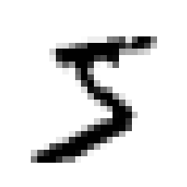
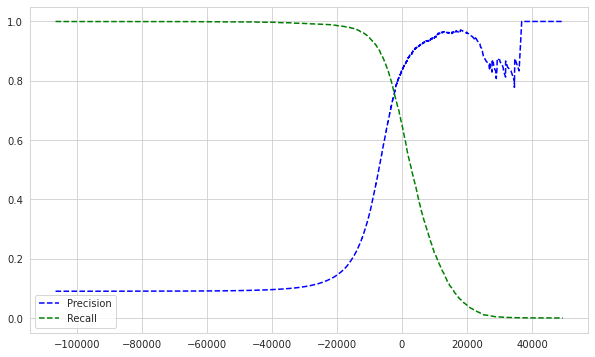
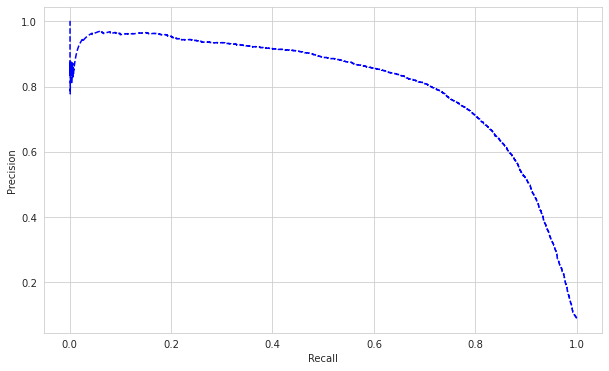
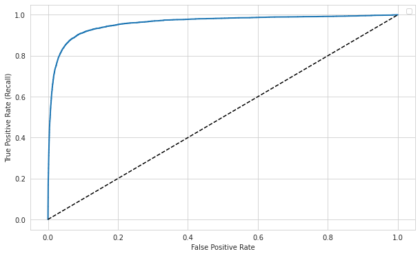
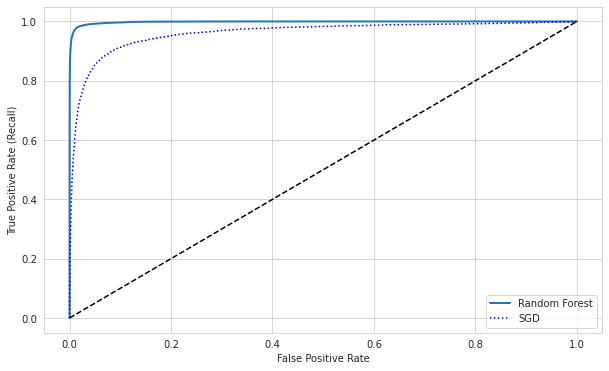
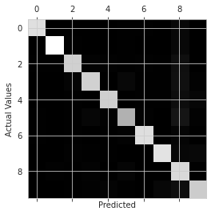
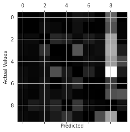
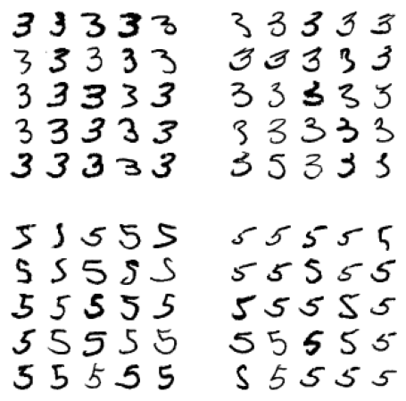
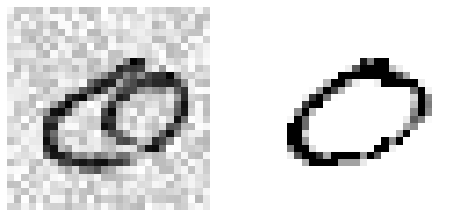

<!--more--> 


## Notes

Classification: predicting classes/categories


### Introducing MNIST
- handwritten digits


```python
from sklearn.datasets import fetch_openml
```


```python
mnist = fetch_openml('mnist_784', version=1)
```


```python
mnist.keys()
```


    dict_keys(['data', 'target', 'frame', 'categories', 'feature_names', 'target_names', 'DESCR', 'details', 'url'])


```python
X, y = mnist['data'], mnist['target']
```


```python
X.shape
```


    (70000, 784)


- 70K samples, 784 features (28x28 pixels)


```python
y.shape
```


    (70000,)


```python
import matplotlib as mpl
import matplotlib.pyplot as plt
```


```python
some_digit = X[0]
some_digit_image = some_digit.reshape(28,28)

plt.imshow(some_digit_image, cmap="binary")
plt.axis("off")
plt.show()
```





```python
y[0]
```


    '5'


- cast target variable to integers


```python
import numpy as np
```


```python
y = y.astype(np.uint8)
```


```python
X_train, X_test, y_train, y_test = X[:60000], X[60000:], y[:60000], y[60000:],
```

- dataset is already shuffled, some CV folds will be similar (no missing digits)

### Training a binary classifier
- simplify the problem to classifying a single digit
- Stochastic Gradient Descent (SGD) classifier: good for large datasets, deals with training instances independently, one at a time
- relies on randomness


```python
y_train_5 = (y_train == 5)
y_test_5 = (y_test == 5)
```


```python
from sklearn.linear_model import SGDClassifier
```


```python
sgd_clf = SGDClassifier(random_state=42)
sgd_clf.fit(X_train, y_train_5)
```


    SGDClassifier(random_state=42)


```python
sgd_clf.predict([some_digit])
```


    array([ True])


### Performance Measures

- Can use cross validation
- Custom implementation of CV:


```python
from sklearn.model_selection import StratifiedKFold
from sklearn.base import clone
```


```python
skfolds = StratifiedKFold(n_splits=3, random_state=42)

for train_index, test_index in skfolds.split(X_train, y_train_5):
    clone_clf = clone(sgd_clf)
    X_train_folds = X_train[train_index]
    y_train_folds = y_train_5[train_index]
    X_test_fold = X_train[test_index]
    y_test_fold = y_train_5[test_index]
    
    clone_clf.fit(X_train_folds, y_train_folds)
    y_pred = clone_clf.predict(X_test_fold)
    n_correct = sum(y_pred == y_test_fold)
    print(n_correct/len(y_pred))
```

    /opt/conda/lib/python3.7/site-packages/sklearn/model_selection/_split.py:297: FutureWarning: Setting a random_state has no effect since shuffle is False. This will raise an error in 0.24. You should leave random_state to its default (None), or set shuffle=True.
      FutureWarning


    0.95035
    0.96035
    0.9604


- performs stratified sampling to get a representative ratio of each class


```python
from sklearn.model_selection import cross_val_score
```


```python
cross_val_score(sgd_clf, X_train, y_train_5, cv=3, scoring="accuracy")
```


    array([0.95035, 0.96035, 0.9604 ])


- accuracy doesn't mean much here, since about 10% of the samples are 5s. If you guess non-5 for every sample you'll get around 90% accuracy


```python
from sklearn.base import BaseEstimator
```


```python
class Never5Classifier(BaseEstimator):
    def fit(self, X, y=None):
        return self
    def predict(self, X):
        return np.zeros((len(X), 1), dtype=bool)
```


```python
never_5_clf = Never5Classifier()
cross_val_score(never_5_clf, X_train, y_train_5, cv=3, scoring='accuracy')
```


    array([0.91125, 0.90855, 0.90915])


- accuracy is generally not the preferred performance measure, especially with skewed datasets

**Confusion Matrix**
- count the number of times instances of class A are classfied as class B


```python
from sklearn.model_selection import cross_val_predict
```

- `cross_val_predict` returns the predictions for each test fold


```python
y_train_pred = cross_val_predict(sgd_clf, X_train, y_train_5, cv=3)
```


```python
y_train_pred.shape
```


    (60000,)


```python
from sklearn.metrics import confusion_matrix
```


```python
confusion_matrix(y_train_5, y_train_pred)
```


    array([[53892,   687],
           [ 1891,  3530]])


- each row represents an actual class
- each column represents a predicted class
- first row of this matrix is non-5s, second row is 5s


- row 1 col 1: true negatives
- row 1 col 2: false positives
- row 2 col 1: false negatives
- row 2 col 2: true positives
- a perfect classifier would only have true positives and true negatives


```python
# pretending we reached perfection
y_train_perfect_predictions = y_train_5
confusion_matrix(y_train_5, y_train_perfect_predictions)
```


    array([[54579,     0],
           [    0,  5421]])


**Precision and Recall**

Precision: accuracy of positive predictions
$$ precision = \frac{TP}{TP+FP} $$

Recall (AKA sensitivity or True Positive Rate):
$$ recall = \frac{TP}{TP+FN} $$


```python
from sklearn.metrics import precision_score, recall_score
```


```python
precision_score(y_train_5, y_train_pred)
```


    0.8370879772350012


```python
recall_score(y_train_5, y_train_pred)
```


    0.6511713705958311


- higher precision than recall: when the classifier predicted a 5, it was likely to be correct. however, this came at the cost of incorrectly predicting non-5 on samples that it was less sure about
- its convenient to combine precision and recall into a single metric, the F1 score:

$$ F_1 = \frac{2}{\frac{1}{precision} + \frac{1}{recall}} = 2\times\frac{precision\times{recall}}{precision + recall} = \frac{TP}{TP + \frac{FN+TP}{2}}$$
- this is the harmonic mean; while regular mean treats all values equally, harmonic mean gives much more weight to low values
- F1 is only high if both precision and recall are


```python
from sklearn.metrics import f1_score
```


```python
f1_score(y_train_5, y_train_pred)
```


    0.7325171197343846


- while F1 is a metric that favours equally good precision and recall, there are instances when prioritizing one of the two is more valuable
- e.g. a classifier that detects whether videos are safe for kids: you want high precision because the cost of being wrong is very high, and its better to reject potentially safe videos if it ensures that no unsafe videos are recommended
- e.g. a classifier for catching shoplifting can favour recall; maximizing the potential for catching all instances of shoplifting is well worth the potential for a few false positives here and there
- there is a tradeoff between precision and recall, can't have it both ways

**Precision/Recall Trade-Off**
- controlled by the threshold at which a sample is classified as true
- can control this threshold by calling `decision_function()` instead of `predict()` for sklearn estimators and setting a threshold yourself:


```python
y_scores = sgd_clf.decision_function([some_digit])
y_scores
```


    array([2164.22030239])


```python
threshold = 0
y_some_digit_pred = (y_scores > threshold)
y_some_digit_pred
```


    array([ True])


```python
threshold = 8000
y_some_digit_pred = (y_scores > threshold)
y_some_digit_pred
```


    array([False])


- raising the threshold increases precision and lowers recall
- lowering the threshold increases recall and lowers precision


```python
y_scores = cross_val_predict(sgd_clf, X_train, y_train_5, cv=3,
                             method='decision_function')
```


```python
from sklearn.metrics import precision_recall_curve
```


```python
precisions, recalls, thresholds = precision_recall_curve(y_train_5, y_scores)
```


```python
import matplotlib.pyplot as plt
import seaborn as sns
%matplotlib inline
sns.set_style('whitegrid')
```


```python
def plot_precision_recall_vs_threshold(precisions, recalls, thresholds, figsize=(10,6)):
    plt.figure(figsize=figsize)
    plt.plot(thresholds, precisions[:-1], 'b--', label='Precision')
    plt.plot(thresholds, recalls[:-1], 'g--', label='Recall')
    plt.legend()
```


```python
plot_precision_recall_vs_threshold(precisions, recalls, thresholds)
plt.show()
```





- precision can go down when the threshold increases
- e.g. getting 4/5 (80%) correct, then raising threshold and getting 3/4 correct (75%)
- can also plot precision vs. recall directly:


```python
def plot_precision_vs_recall(precisions, recalls, figsize=(10,6)):
    plt.figure(figsize=figsize)
    plt.plot(recalls, precisions, 'b--')
    plt.xlabel('Recall')
    plt.ylabel('Precision')
```


```python
plot_precision_vs_recall(precisions, recalls)
plt.show()
```





- precision really starts to dip around 70% recall
- might make sense to set the threshold before that drop, but depends on the context of your project
- to set the threshold at a specific precision:
- `np.argmax()` gives the first index of the maximum value; in this case, the first instance where precision > 90 is true


```python
threshold_90_precision = thresholds[np.argmax(precisions >= 0.9)]
threshold_90_precision
```


    3370.0194991439557


```python
y_train_pred_90 = (y_scores >= threshold_90_precision)
```


```python
precision_score(y_train_5, y_train_pred_90)
```


    0.9000345901072293


```python
recall_score(y_train_5, y_train_pred_90)
```


    0.4799852425751706


**The ROC Curve**

- Receiver Operating Characteristic
- plots true positive rate (TPR) vs false positive rate (FPR)
- FPR is ratio of false positives, i.e. 1 - True Negative Rate (TNR)
- TNR is also known as specificity
- ROC is plotting sensitivity (recall) vs 1 - specificity


```python
from sklearn.metrics import roc_curve
```


```python
fpr, tpr, thresholds = roc_curve(y_train_5, y_scores)
```


```python
def plot_roc_curve(fpr, tpr, label=None, figsize=(10,6)):
    plt.figure(figsize=figsize)
    plt.plot(fpr, tpr, linewidth=2, label=label)
    plt.plot([0,1], [0,1], 'k--')
    plt.xlabel('False Positive Rate')
    plt.ylabel('True Positive Rate (Recall)')
    plt.legend()
```


```python
plot_roc_curve(fpr, tpr)
plt.show()
```

    No handles with labels found to put in legend.





- dotted line represents purely random classifier
- good classifiers have the highest true positive rate with the lowest false positive rate (top left corner)
- can compare ROC scores of different classifiers by measuring area under the curve AUC
- a purely random classifier will have an AUC of 0.5 (think the integral of the purely random classifier, the linear line)
- false positive rate is so high here because there aren't that many 5s in the data (only about 10%), so don't get misled by the great looking ROC curve


```python
from sklearn.metrics import roc_auc_score
```


```python
roc_auc_score(y_train_5, y_scores)
```


    0.9604938554008616


- use the precision/recall curve when the positive class is rare or you care more about the false positives than the false negatives
- otherwise use the ROC curve
- for skewed datasets where the positive class is rare, you can see that precision really suffers when recall increases (a result of having less training data on the positive class, the classifier is trying to catch every positive class despite not having a lot to go off of). paints a different picture than ROC
- Try calculating ROC, AUC, Precision and Recall for Random Forest estimator:


```python
from sklearn.ensemble import RandomForestClassifier
```


```python
forest_clf = RandomForestClassifier(random_state=42)
```


```python
y_probas_forest = cross_val_predict(forest_clf, X_train, y_train_5, cv=3,
                                    method='predict_proba')
```


```python
y_scores_forest = y_probas_forest[:, 1] # score = proba of positive class
```


```python
fpr_forest, tpr_forest, thresholds_forest = roc_curve(y_train_5,
                                                      y_scores_forest)
```


```python
plot_roc_curve(fpr_forest, tpr_forest, label="Random Forest")
plt.plot(fpr, tpr, "b:", label="SGD")
plt.legend()
plt.show()
```





- Closer to top left than SGD, more AUC, better performance
- Explaining the ROC curve: to achieve an almost 99% recall/TPR rate (we correctly predict positive for 99% of all the real positive samples in the dataset), it seems like we will have to accept the tradeoff of getting 15% of the negative samples incorrectly predicted as positive (the false positive rate)


```python
roc_auc_score(y_train_5, y_scores_forest)
```


    0.9983436731328145


```python
y_preds_forest = cross_val_predict(forest_clf, X_train, y_train_5,
                                        cv=3)
```


```python
precision_score(y_train_5, y_preds_forest)
```


    0.9905083315756169


```python
recall_score(y_train_5, y_preds_forest)
```


    0.8662608374838591


### Multiclass Classification
- AKA multinomial
- Logistic Regression, Random Forest, naive Bayes classifiers are examples of algorithms that can make multiclass classifications natively
- Can get around this with algos that only work as binary; in the example of MNIST train 10 binary classifiers, pick the class with the highest decision score. Known as one-versus-rest/one-versus-all strategy (OvR).
- You could also train a binary classifier for every pair of digits. i.e. 1 vs 2, 1 vs 3, 2 vs 5, etc. This is one-versus-one (OvO) strategy, and you pick the classifier that wins the most duels. Advantage of this strategy is that you only train the classifiers on subsets of the entire target variable space
- Some algos scale poorly with the size of the training set, so OvO strategy is preferred
- In general however, OvR is preferred, as its more straightforward
- Sklearn classifiers will automatically detecty multiclass classifications from the target variable and will use a strategy based on the algorithm used


```python
from sklearn.svm import SVC
```


```python
# svm_clf = SVC()
# svm_clf.fit(X_train, y_train) # all digits in target variable
# svm_clf.predict([some_digit])
```

- SVC uses OvO strategy; it actually trained 45 binary classifiers
- NOTE: This takes forever to run. Sklearn can't use GPUs to speed up training; GPUs are only useful for training deep learning models with architectures like Tensorflow or PyTorch
- SVMs have a quadratic time complexity, calculating the distance between each point in the dataset:
$$ O({n_{features}}\times{n_{observations}^2}) $$
- Caches common points but this kills memory regardless
- This doesn't scale well over a couple 10k features


- `decision_function()` returns 10 scores per instance, and classifier picked the highest one:


```python
# some_digit_scores = svm_clf.decision_function([some_digit])
# some_digit_scores
```


```python
# np.argmax(some_digit_scores)
```


```python
# svm_clf.classes[np.argmax(some_digit_scores)]
```

- index just happened to match the class itself, but this is just luck
- Sklearn can be forced to use either OvO or OvR using `OneVsOneClassifier` or `OneVsRestClassifier` classes; just create an instance with the classifier you want passed as constructor


```python
from sklearn.multiclass import OneVsRestClassifier
```


```python
# ovr_clf = OneVsRestClassifier(SVC())
# ovr_clf.fit(X_train, y_train)
# ovr_clf.predict([some_digit])
```


```python
# len(ovr_clf.estimators_)
```

- SGD Classifiers can directly classify instances into multiple classes
- Decision function returns a score per class


```python
sgd_clf.fit(X_train, y_train)
sgd_clf.predict([some_digit])
```


    array([3], dtype=uint8)


```python
sgd_clf.decision_function([some_digit])
```


    array([[-31893.03095419, -34419.69069632,  -9530.63950739,
              1823.73154031, -22320.14822878,  -1385.80478895,
            -26188.91070951, -16147.51323997,  -4604.35491274,
            -12050.767298  ]])


```python
cross_val_score(sgd_clf, X_train, y_train, cv=3, scoring="accuracy")
```


    array([0.87365, 0.85835, 0.8689 ])


- 84% on all testing folds is decent - if you were to use a random classifier you'd get 10% accuracy
- simply scaling inputs can increase score:


```python
from sklearn.preprocessing import StandardScaler
```


```python
scaler = StandardScaler()
X_train_scaled = scaler.fit_transform(X_train.astype(np.float64))
```


```python
cross_val_score(sgd_clf, X_train_scaled, y_train, cv=3,
                scoring="accuracy")
```


    array([0.8983, 0.891 , 0.9018])


### Error Analysis

- can improve shortlisted models by analyzing the errors they make
- make predictions using the `cross_val_predict()` function, then call `confusion_matrix()`:


```python
y_train_pred = cross_val_predict(sgd_clf, X_train_scaled, y_train, cv=3)
conf_mx = confusion_matrix(y_train, y_train_pred)
```


```python
conf_mx
```


    array([[5577,    0,   22,    5,    8,   43,   36,    6,  225,    1],
           [   0, 6400,   37,   24,    4,   44,    4,    7,  212,   10],
           [  27,   27, 5220,   92,   73,   27,   67,   36,  378,   11],
           [  22,   17,  117, 5227,    2,  203,   27,   40,  403,   73],
           [  12,   14,   41,    9, 5182,   12,   34,   27,  347,  164],
           [  27,   15,   30,  168,   53, 4444,   75,   14,  535,   60],
           [  30,   15,   42,    3,   44,   97, 5552,    3,  131,    1],
           [  21,   10,   51,   30,   49,   12,    3, 5684,  195,  210],
           [  17,   63,   48,   86,    3,  126,   25,   10, 5429,   44],
           [  25,   18,   30,   64,  118,   36,    1,  179,  371, 5107]])


- As a heatmap:


```python
plt.matshow(conf_mx, cmap=plt.cm.gray)
plt.xlabel("Predicted")
plt.ylabel("Actual Values")
plt.show()
```





- Main diagonal: predicted rate of actual digit
- Rows are actual classes, Columns are predicted classes
- Lower rate could mean that less of that class in the dataset or lower performance on it

- Can divide absolute prediction sums by total number of instances for each class to get error rates:


```python
row_sums = conf_mx.sum(axis=1, keepdims=True)
norm_conf_mx = conf_mx / row_sums

np.fill_diagonal(norm_conf_mx, 0) # fill in diagonals to look at errors only
plt.matshow(norm_conf_mx, cmap=plt.cm.gray)
plt.xlabel("Predicted")
plt.ylabel("Actual Values")
plt.show()
```





- Many different numbers get misclassified for 8s, but 8s themselves seem to get classified properly
- Confusion matrix isn't symmetrical necessarily
- General confusion around 5s and 3s too
- If we wanted to fix the model, focusing on improving scores on 8s would be beneficial:
- Could collect more data on numbers that look like 8s but aren't 8s
- Could add extra features, like writing an algorithm to count closed loops, or preprocessing the image to make some patterns like closed loops stand out more
- Analyzing individual errors is good too but time consuming


```python
def plot_digits(instances, images_per_row=10, **options):
    size = 28
    images_per_row = min(len(instances), images_per_row)
    images = [instance.reshape(size,size) for instance in instances]
    n_rows = (len(instances) - 1) // images_per_row + 1
    row_images = []
    n_empty = n_rows * images_per_row - len(instances)
    images.append(np.zeros((size, size * n_empty)))
    for row in range(n_rows):
        rimages = images[row * images_per_row : (row + 1) * images_per_row]
        row_images.append(np.concatenate(rimages, axis=1))
    image = np.concatenate(row_images, axis=0)
    plt.imshow(image, cmap = mpl.cm.binary, **options)
    plt.axis("off")
```


```python
cl_a, cl_b = 3, 5
X_aa = X_train[(y_train == cl_a) & (y_train_pred == cl_a)]
X_ab = X_train[(y_train == cl_a) & (y_train_pred == cl_b)]
X_ba = X_train[(y_train == cl_b) & (y_train_pred == cl_a)]
X_bb = X_train[(y_train == cl_b) & (y_train_pred == cl_b)]

plt.figure(figsize=(8,8))
plt.subplot(221); plot_digits(X_aa[:25], images_per_row=5)
plt.subplot(222); plot_digits(X_ab[:25], images_per_row=5)
plt.subplot(223); plot_digits(X_ba[:25], images_per_row=5)
plt.subplot(224); plot_digits(X_bb[:25], images_per_row=5)
```





- row 1 col 1: 3s that were classified as 3s
- row 1 col 2: 3s that were classified as 5s
- row 2 col 1: 5s that were classified as 3s
- row 2 col 2: 5s that were classified as 5s


- Hard to understand why SGD classifier made the errors it did; as a linear model, it just assigned a weight per pixel and when it sees a new image it sums up the weighted pixel intensities to get a score for each class
- 3s are different from 5s mainly with the vertical line that connects the top horizontal line and the bottom arc; this means the classifier would be quite sensitive to image shifting and rotation
- Could preprocess images to make sure they're centered/not too rotated

### Multilabel Classification

- Assigning multiple labels to one sample
- E.g. detecting multiple people's faces in a photo, or whether a digit is even or odd
- Outputs multiple binary tags. E.g. y_pred = [1, 0, 1] (yes to classes 1 and 3, no to 2)


```python
from sklearn.neighbors import KNeighborsClassifier
```

- Side note: % (Modulus) yields the remainder when the first operand is divided by the second


```python
5 % 3 # 3 goes into 5 once, with remainder 2
```


    2


```python
10 % 3 # 3 goes into 10 three times, with remainder 1
```


    1


```python
y_train_large = (y_train >= 7)
y_train_odd = (y_train % 2 == 1)
y_multilabel = np.c_[y_train_large, y_train_odd]
```


```python
y_multilabel
```


    array([[False,  True],
           [False, False],
           [False, False],
           ...,
           [False,  True],
           [False, False],
           [ True, False]])


- label 1: digit is 7 or above
- label 2: digit is odd


```python
knn_clf = KNeighborsClassifier()
knn_clf.fit(X_train, y_multilabel)
```


    KNeighborsClassifier()


- KNeighbors supports multilabel classification, though not all classifiers do


```python
knn_clf.predict([some_digit]) # some_digit = 5
```


    array([[False,  True]])


- One approach to measure multilabel performance is measure F1 score for each individual label and compute the average score across them:


```python
y_train_knn_pred = cross_val_predict(knn_clf, X_train, y_multilabel, cv=3)
```


```python
f1_score(y_multilabel, y_train_knn_pred, average="macro")
```


    0.976410265560605


- this assumes that all labels are equally important, which might not always be the case
- can give labels weight according to number of appeareances in training data by setting `average="weighted"`

### Multioutput Classification

- Generalization of multilabel classification where each label can be multiclass (i.e. have more than two possible values)
- following example denoises images by predicting what the pixel intensitiy should be for each pixel in a sample (multiple classes for multiple labels)
- this somewhat blurs the line between classification and regression (predicting pixel intensity is more of a regression task)


```python
noise = np.random.randint(0, 100, (len(X_train), 784))
X_train_mod = X_train + noise
noise = np.random.randint(0, 100, (len(X_test), 784))
X_test_mod = X_test + noise
y_train_mod = X_train
y_test_mod = X_test
```


```python
def plot_digit(data):
    image = data.reshape(28, 28)
    plt.imshow(image, cmap = mpl.cm.binary,
               interpolation="nearest")
    plt.axis("off")
```


```python
knn_clf.fit(X_train_mod, y_train_mod)
```


    KNeighborsClassifier()


```python
some_index = np.random.randint(0, len(X_test_mod))
clean_digit = knn_clf.predict([X_test_mod[some_index]])
```


```python
plt.figure(figsize=(8,4))
plt.subplot(121); plot_digit(X_test_mod[some_index])
plt.subplot(122); plot_digit(clean_digit)
```





## Exercises in a Separate Notebook
